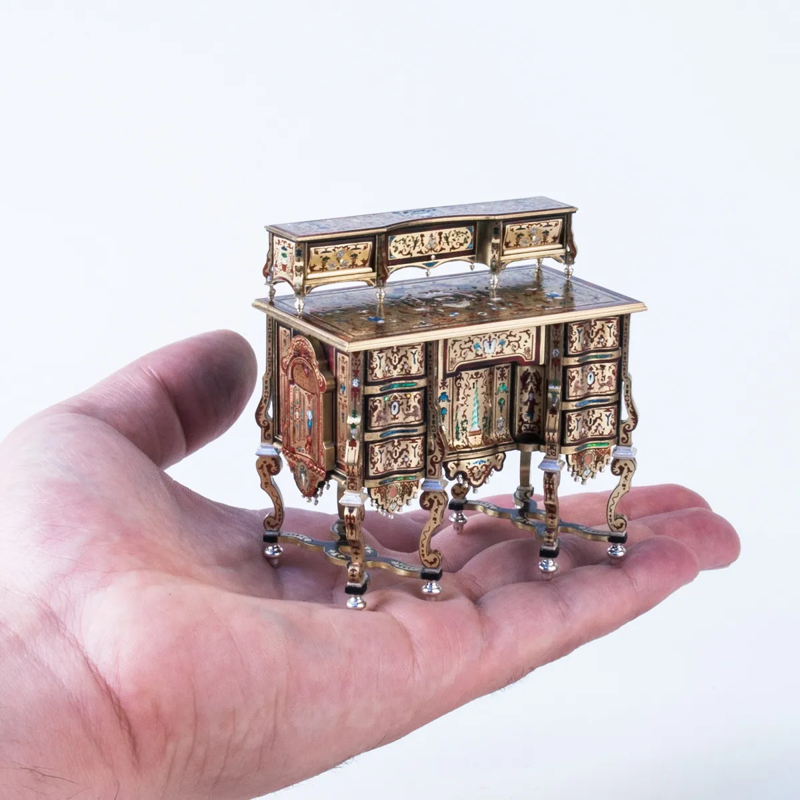
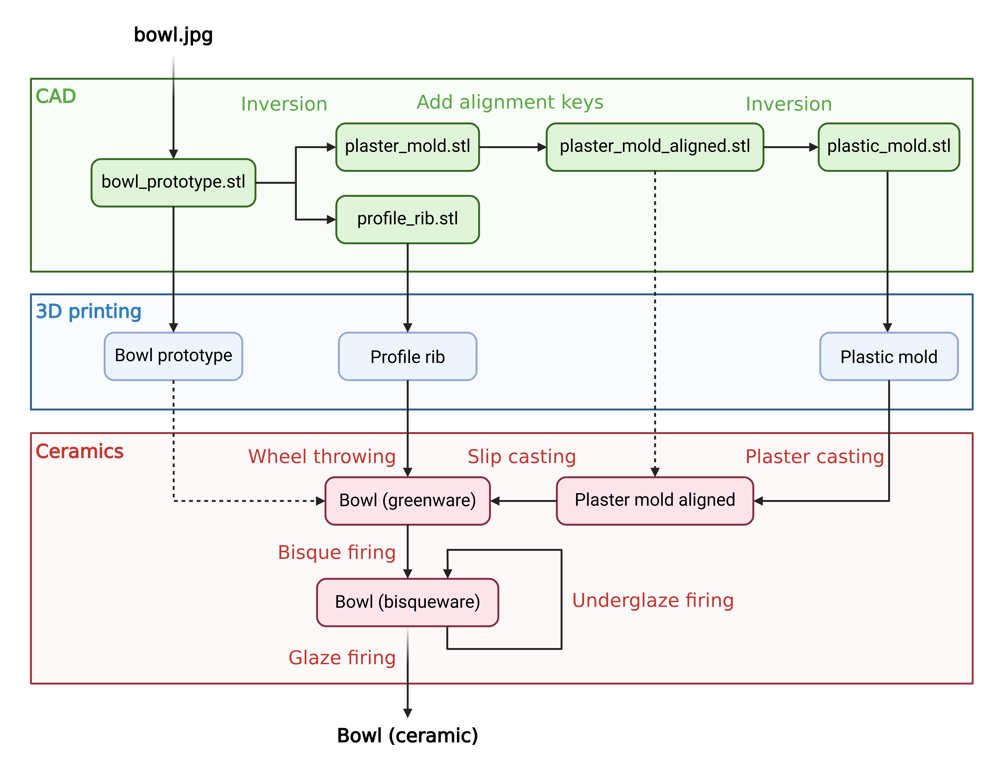
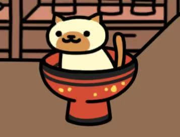

# CeraMini: Two methods for Translating Virtual Objects into Miniature Ceramics

This project explores and compares two approaches to integrating CAD and 3D printing into ceramic fabrication to translate a bowl from the game Neko Atsume: Kitty Collector into a physical miniature ceramic object. Working at a miniature scale introduces additional challenges, requiring greater precision in forming, mold-making, and material control. The two workflows include slip casting using 3D printed forms to produce plaster molds, and wheel throwing guided by 3D-designed and printed profile tools. The results highlight a balance between digital precision, reproducibility, and manual intervention. These methods can be extended to AI-generated models, encouraging reflection on the role of manual craftsmanship in an increasingly automated design landscape.

# Inspiration 
*Neko Atsume: Kitty Collector* is a game I enjoy, and although it once released PVC figurines, they are now discontinued and difficult to find. I have also long been interested in collecting realistic miniatures made from the same materials as their full-scale counterparts, and I was amazed by historical miniature projects such as Queen Mary's Dolls' House created by leading craftsmen in early 20th-century Britain. These interests and inspirations led me to the challenge of creating a true miniature ceramic bowl at the scale and precision of the official Neko Atsume PVC figurines.

  

*Image by David Iriarte. Used for reference. All rights belong to the original artist.*

# Abstract 

  

## Tutorial
All 3D models are printed by Prusa CORE One at the Duke Innovation Co-Lab. 
* Specific printer settings:
  * Nozzle (mm): 0.4
  * Layer thickness (mm): 0.12
  * Perimeters: 2
  * Infill density (%): 15
  * Infill pattern: Gyroid
  * Support type: Grid
* Number of each 3D model that need to be printed: 
  * Slip casting
    * wall_align_mold_core.stl: 4
      * Or 1 but cast 4 times for 4 walls
    * wall_align_mold_side.stl: 8
      * Or 2 but cast 4 times for 4 walls
    * bottom_align_mold_core.stl: 4
    * bottom_align_mold_side.stl: 1
    * bottom_align_mold_tray.stl: 1
  * Wheel throwing
    * profile_rib.stl: 1

### 3D model design and printing
1. Using the screenshot of the bowl in the game and images of official PVC figurines, the parameters of the bowl are measured. 

  

2. A 3D model of the bowl is designed and printed for physical size estimation and thickness adjustment. 
3. By inverting the 3D model of the bowl in different ways, one can generate either 
   * A virtual plaster mold for slip casting or
   * A profile rib for wheel throwing

__If choosing slip casting method,__
1. Alignment keys are added to the virtual plaster mold, which will be inverted to make virtual plastic mold for the plaster mold.
1. Plastic mold is printed. Plaster casting generates the physical plaster mold with alignment keys. 
1. Slip casting into the plaster mold generates the bowl greenware. 
   * In addition to slip casting, plaster molds made in similar ways can also be used for concrete or metal castings. 

__If choosing wheel throwing method,__
1. The profile rib is printed and used in wheel throwing to control the silhouette of the bowl greenware. 

### Ceramic firing
1. After the bowl greenware reaches bone dry, it is bisque fired.
1. Underglaze is applied on bisqueware to match the coloring. Bisqueware is fired again to get rid of the moisture from the underglaze. 
   * Underglaze can also be applied on greenware but applying it on bisqueware allows more control, which benefits the miniature scale. 
1. If a ceramic texture is preferred, the colored bowl bisqueware is glazed with transparent glaze and fired  to generate the eventual ceramic bowl with high precision to the official item. 
   * Although glaze can also be used for coloring, underglaze with transparent glaze reduces the potential smudging of the manually painted patterns. 

# Results and discussions
Slip-cast duplicates maintain higher fidelity to the original dimensions, but mold generation requires more time and careful consideration of undercuts and geometry. Wheel throwing with a customized profile rib is more direct, but it depends heavily on the maker’s skill, offering greater flexibility at the cost of reduced dimensional accuracy.

After bisque firing, slip-cast bowls tend to exhibit more chipping along the rim than wheel-thrown ones, possibly because the casting process involves less mechanical compression of the clay, resulting in a weaker structure. Glaze firing appears to be less influenced by the forming method used to produce the greenware.

# Future Directions
To address chipping in slip-cast miniatures, the use of deflocculants can be further explored to optimize the rheology of the casting slip. By reducing water content while maintaining fluidity, deflocculants enable higher solid loading, resulting in a denser and more mechanically robust cast.

AI can be integrated into the workflow to improve efficiency. However, current applications remain limited in generating highly accurate 3D models, which may come at the expense of precision, an issue that becomes more pronounced at miniature scales.

# License
© 2026 Junqi Lu.

This project, including all STL files, is licensed under the Creative Commons Attribution-NonCommercial-NoDerivatives 4.0 International (CC BY-NC-ND 4.0) license.

You may view and download the files for personal, non-commercial use only. Modification, redistribution, or commercial use is not permitted without explicit permission.

## QR code for this project

  

You can explore more of my projects on my GitHub page! 

# Remainder
!! photos of the end results 

